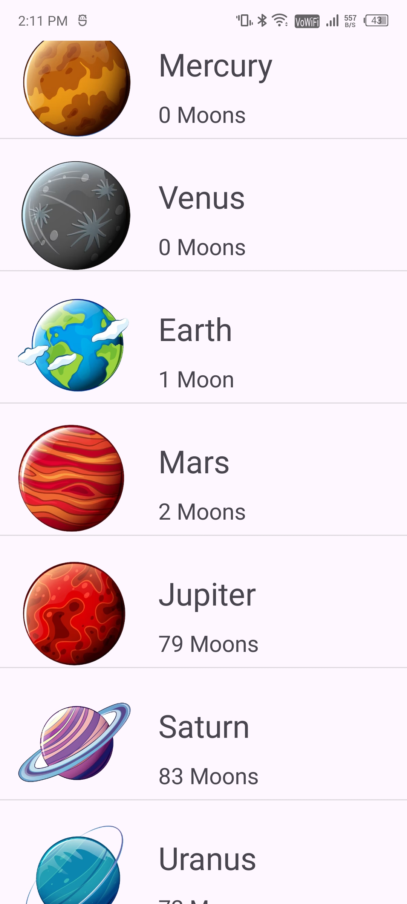

# PlanetsApp 🌍🌕🪐

PlanetsApp is an Android project designed to practice the concepts of Adapters and ListView. The main screen features a ListView displaying all 8 planets of our solar system. Each list item includes an image of the planet, the planet's name, and the number of moons. When a list item is clicked, a toast message shows the planet's name.

## Features
- **Main Screen:**
  - ListView displaying all 8 planets of the solar system.
  - Each list item contains:
    - An ImageView for the planet image.
    - A TextView for the planet name.
    - A TextView for the number of moons on that planet.
  - On clicking a list item, a toast message shows the name of the planet.

## Technologies Used
- Java
- Android Studio
- ListView
- Custom Adapter
- Toast messages

## Screenshots
- **Main Screen:**

  

## How to Run
1. Clone the repository: `git clone https://github.com/kaifali744/PlanetsApp.git`
2. Open in Android Studio
3. Build and run on an emulator or physical device

## Connect with Me
- [Twitter](https://twitter.com/kaifali744)
- [LinkedIn](https://www.linkedin.com/in/mohammad-kaif-ali-3a19671a0/)
- [Instagram](https://www.instagram.com/__kaifu/)

